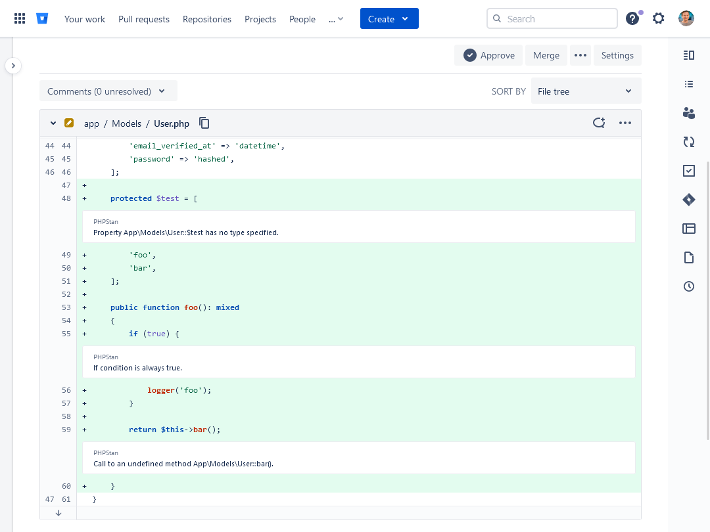
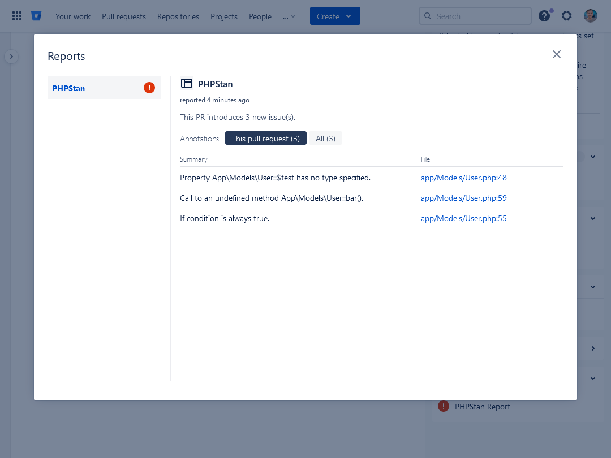

# PHPStan Bitbucket error formatter

[![Latest Version on Packagist][ico-version]][link-packagist]
[![Software License][ico-license]](LICENSE.md)
[![Buy us a tree][ico-treeware]][link-treeware]
[![Total Downloads][ico-downloads]][link-downloads]
[![Maintained by SWIS][ico-swis]][link-swis]

This PHPStan error formatter will add annotations in Bitbucket, for example in pull requests, similar to the built-in GitHub formatting.

## Installation

Via Composer

```bash
composer require --dev swisnl/phpstan-bitbucket
```

If you also have [phpstan/extension-installer](https://github.com/phpstan/extension-installer) installed, then you're all set!

<details>
  <summary>Manual installation</summary>

If you don't want to use `phpstan/extension-installer`, include extension.neon in your project's PHPStan config:

```neon
includes:
    - vendor/swisnl/phpstan-bitbucket/extension.neon
```
</details>

## Usage

To use this custom error formatter you need to run PHPStan with `--error-format=bitbucket` option. For example:
```shell
vendor/bin/phpstan analyse src -l8 --error-format=bitbucket
```

## Screenshots




## Changelog

Please see [CHANGELOG](CHANGELOG.md) for more information on what has changed recently.

## Contributing

Please see [CONTRIBUTING](CONTRIBUTING.md) and [CODE_OF_CONDUCT](CODE_OF_CONDUCT.md) for details.

## Security

If you discover any security related issues, please email security@swis.nl instead of using the issue tracker.

## Credits

This package is a fork of [alxt/phpstan-bitbucket][link-fork] with some updates.

- [Alexander Timmermann][link-author]
- [All Contributors][link-contributors]

## License

The MIT License (MIT). Please see [License File](LICENSE.md) for more information.

This package is [Treeware](https://treeware.earth). If you use it in production, then we ask that you [**buy the world a tree**][link-treeware] to thank us for our work. By contributing to the Treeware forest you’ll be creating employment for local families and restoring wildlife habitats.

## SWIS :heart: Open Source

[SWIS][link-swis] is a web agency from Leiden, the Netherlands. We love working with open source software.

[ico-version]: https://img.shields.io/packagist/v/swisnl/phpstan-bitbucket.svg?style=flat-square
[ico-license]: https://img.shields.io/badge/license-MIT-brightgreen.svg?style=flat-square
[ico-treeware]: https://img.shields.io/badge/Treeware-%F0%9F%8C%B3-lightgreen.svg?style=flat-square
[ico-downloads]: https://img.shields.io/packagist/dt/swisnl/phpstan-bitbucket.svg?style=flat-square
[ico-swis]: https://img.shields.io/badge/%F0%9F%9A%80-maintained%20by%20SWIS-%230737A9.svg?style=flat-square

[link-packagist]: https://packagist.org/packages/swisnl/phpstan-bitbucket
[link-downloads]: https://packagist.org/packages/swisnl/phpstan-bitbucket
[link-treeware]: https://plant.treeware.earth/swisnl/phpstan-bitbucket
[link-fork]: https://github.com/modprobe/phpstan-bitbucket
[link-author]: https://github.com/modprobe
[link-contributors]: ../../contributors
[link-swis]: https://www.swis.nl
